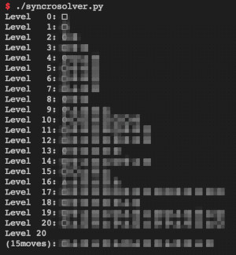

# Syncro Game Solver

This code computes solutions for [Syncro](https://rawegg.itch.io/syncro) (the game).

# Syncro

"Syncro is an immersive, soothing and brain-teasing experience.
This game challenges logical reasoning by the use of mathematics,
conveying a graphical representation of a principle in the Automata Theory."

Syncro was developed by [MathGurl](https://www.youtube.com/c/MathGurl)
and [RawEgg](https://rawegg.itch.io/),
as explained in [this video](https://youtu.be/iXgm0qmP3cw).

Thank them for this nice collection of puzzles.

# Finding solutions

This code computes a solution for each level and prints it.
Shortest solution is NOT guaranteed.

The algorithm used is brute force (DFS - depth first search).
There is a slight improve by pruning repetitive states on the same "path".

